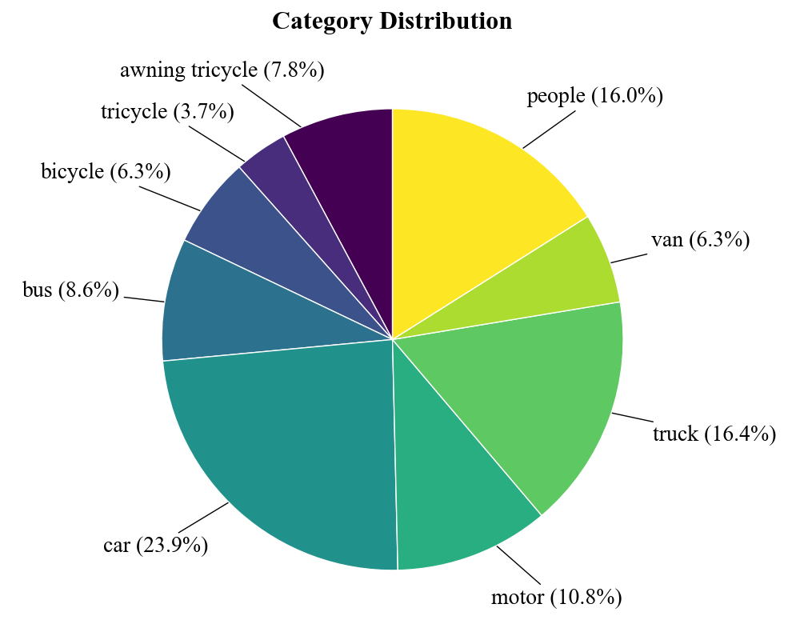
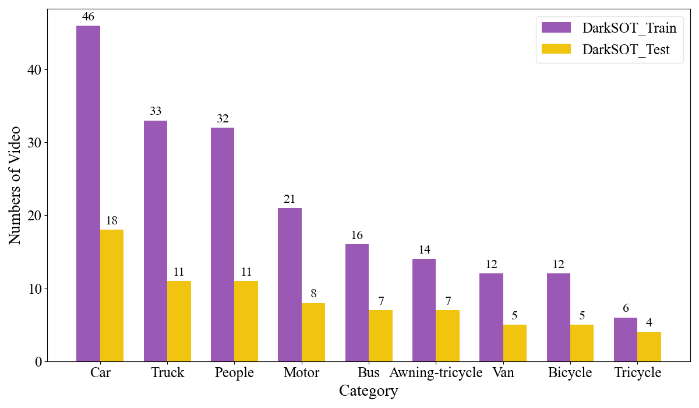
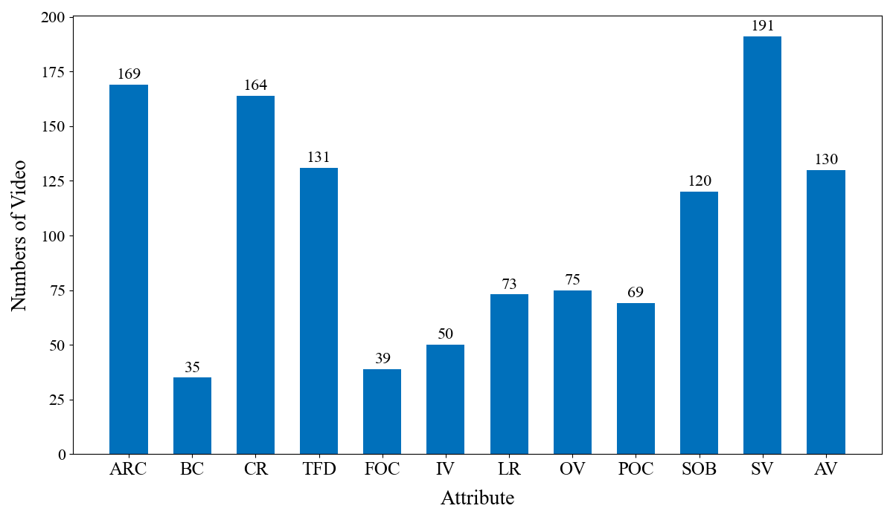

# DarkSOT-Dataset
To advance nighttime UAV tracking research, we present DarkSOT, a dedicated benchmark dataset consisting of 268 annotated video sequences for low-light algorithm development and evaluation. Each sequence is annotated with 12 challenging attributes. The dataset includes nine common target categories: Pedestrian, Tricycle, Bicycle, Bus, Truck, Awning-tricycle, Motorcycle, Car, and Van. All data were captured using a DJI M30T UAV platform under varied real-world nighttime conditions, with flight altitudes ranging from 10 to 100 meters and camera pitch angles between 15 and 90 degrees. This ensures rich diversity in viewpoint and scene content. The dataset is divided into 192 training sequences and 76 testing sequences with no scene overlap, covering all target categories. It provides a comprehensive and reproducible benchmark for the community. 

# Download DarkSOT
DarkSOT Dataset.z01 
链接: https://pan.baidu.com/s/13JjFf1s_2p6RP4kfOXhuyQ?pwd=t1e9 提取码: t1e9  
DarkSOT Dataset.zip 
链接: https://pan.baidu.com/s/1V7iEUvswyv4RfvVpM8MvNA?pwd=9pn3 提取码: 9pn3 

# Target Classes and Application Scenarios
In alignment with the object category definitions from the VisDrone dataset, nine representative 
target classes were selected: People, Tricycle, Bicycle, Bus, Truck, Awning-tricycle, Motor, Car, 
and Van(shown in Fig. 1.).

  
  
<em>Fig. 1. Nine representative objects. (a) People; (b) Awning tricycle; (c) Bicycle; (d) Bus; (e) Car; (f) Motor; (g) tricycle; (h) truck; (i) van.</em>

Each video sequence was annotated according to its corresponding object class. Fig. 2 summarizes 
the distribution of object categories in our dataset...

  
  
<em>Fig. 2. Proportional distribution of nine object categories in the DarkSOT dataset.</em>

To ensure coverage of diverse nighttime conditions, six representative application scenarios were 
selected (Fig. 3)...

  
  
<em>Fig. 3. Six representative nighttime scenes. (a) Urban streets; (b) Urban arterial roads; (c) Campus grounds; (d) Grade-separated interchanges; (e) Pedestrian overpasses; (f) Rural areas.</em>

# Data Processing
The collected data were first filtered to exclude videos with insufficient motion duration or 
limited relative target movement. After filtering, a total of 268 video sequences were selected. 
Bounding boxes were manually annotated using the DarkLabel software. A team of eight trained 
annotators labeled every frame, followed by several rounds of cross-checking to minimize 
annotation errors. The overall annotation process lasted more than three months.

The annotated video sequences were partitioned into 192 training sequences and 76 testing 
sequences, with no overlap between the two sets and full coverage of all target categories, 
as illustrated in Fig. 4.

  
  
<em>Fig. 4. Distribution of object categories in the training and test sets of the DarkSOT dataset.</em>

# 12 Attributes
Most existing nighttime low-light datasets lack comprehensive attribute annotations. For example, 
UAVDark135 includes only six. To facilitate a more thorough performance evaluation of tracking 
algorithms, we manually annotated 12 representative and challenging attributes: aspect ratio 
change (ARC), background clutter (BC), camera rotation (CR), target fast displacement (TFD), 
full occlusion (FOC), illumination variation (IV), low resolution (LR), out-of-view (OV), 
partial occlusion (POC), similar object (SOB), scale variation (SV), and appearance variation 
(AV). The attribute taxonomy was derived from the UAV123 dataset and refined to align with the 
characteristics of our collected data. Detailed definitions of all attributes are provided in 
Table 1, and their distribution across the dataset is visualized in Fig. 5.

**Table 1. Descriptions of 12 different attributes in DarkSOT**

| Attribute | Definition |
|:---------:|:-----------|
| **Aspect Ratio Change (ARC)** | Aspect ratio change between initial frame and subsequent frames exceeds [0.5, 2] range |
| **Background Clutter (BC)** | Background Clutter: the background near the target has similar appearance as the target |
| **Camera Rotation (CR)** | Camera Rotation: abrupt rotation of the camera |
| **Target Fast Displacement (TFD)** | Target Fast Displacement: the motion of the ground truth is larger than tm pixels (tm = 20) |
| **Full Occlusion (FOC)** | Full Occlusion: the target is fully occluded |
| **Illumination Variation (IV)** | Illumination Variation: the illumination of the target changes significantly |
| **Low Resolution (LR)** | Low Resolution: the number of pixels inside the ground truth rectangle is less than tr (tr = 1000) |
| **Out of View (OV)** | Out-of-View: some portion of the target leaves the view |
| **Partial Occlusion (POC)** | Partial Occlusion: the target is partially occluded |
| **Similar Object (SOB)** | Similar Object: there are objects of similar shape or same type near the target |
| **Scale Variation (SV)** | Scale Variation: the ratio of initial and at least one subsequent bounding box is outside the range [0.5, 2] |
| **Appearance Variation (AV)** | Appearance Variation: target appearance varies significantly |

  
  
<em>Fig. 5. Distribution of 12 challenging attributes in the DarkSOT dataset.</em>

# Citing DarkSOT
@INPROCEEDINGS{darksot, 
  author={Chen, Yanyan and Fu, Ruigang and Song, Yu and Zhong, Ping}, 
  title={TAE: Target-Aware Enhancer for Nighttime UAV Tracking}, 
  booktitle={IEEE International Conference on Image Processing (ICIP)}, 
  year={2026}, 
  publisher={IEEE} 
}
